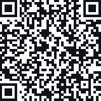

## Module festival 8.1 ❤️U Festival App
Dit is een interactieve, mobiele festivalgids (Progressive Web App) die functioneert als het digitale programmaboekje voor de bezoekers van het ❤️U Festival.

* **In de basis doet deze app het volgende:**<br>
* **Programma tonen:** Bezoekers kunnen snel zien welke artiesten en acts er op de zaterdag en zondag optreden en hoe laat.<br>
* **Plattegrond aanbieden:** Er zit een interactieve kaart in waarmee bezoekers gemakkelijk hun weg kunnen vinden naar de verschillende podia en voorzieningen (zoals barren of toiletten) op het festivalterrein.<br>
* **Offline werken:** Eenmaal geopend via de QR-code, blijft de app ook zonder internetverbinding (4G/5G) op het festivalterrein volledig werken.

## Project Structuur
```
MODULE-FESTIVAL-8.1/
├── artist-images/                 # Artist profile photos and artwork
├── beoordeling-criterium/         # beoordeling criterium folder met 2 bladen van evaluatie
│   ├── beoordelen.png             # criteriumblad over applicatie en eindproduct
│   └── beoordeling-2.png          # criteriumblad over code, kwaliteit, gitrepo, tests, demo en reflectie
├── database/                      # Data layer
│   └── festival_artists.sql       # Artist database with festival info
├── icons/                         # PWA app icons
│   ├── icon-192.png               # Icon for mobile home screen
│   └── icon-512.png               # Large icon for splash screens
├── pages/                         # Multi-page app sections
│   ├── info.html                  # Festival information & details
│   ├── map.html                   # Venue map and location
│   └── schedule.html              # Festival schedule & timeline
├── svg_files/                     # Vector graphics and illustrations
├── app.js                         # Main application logic
├── artist.html                    # Individual artist detail page
├── beoordelen.png                 # paper with feedback from students
├── index.html                     # Home page entry point
├── manifest.json                  # PWA manifest (offline support)
├── qr-install.html                # QR code for PWA installation
├── README.md                      # Project documentation
├── style.css                      # Global styling
└── sw.js                          # Service worker (offline functionality)
```

## Planning - trello
**Trello-bord link:** https://trello.com/b/v8jOhlv2/module-81

## Installeer de App
Nu kun je je telefoon erbij pakken om de app daadwerkelijk te installeren:

* **Stap 1:** Open de camera-app van je telefoon en richt deze op de QR-code op je computerscherm.
* **Stap 2:** Tik op de melding/link die in je camerascherm verschijnt. Je telefoon opent nu de festivalwebsite.
* **Stap 3:** Je krijgt nu een notificatie pop up dat zegt of je het wilt installeren, Druk nu op installeren.




## AI Prompts used

<details>
<summary>Klik om prompts te bekijken</summary>

**Prompt:** Add a dark/light mode toggle to the header. Clicking it switches the background and text colors of the entire app.<br>
**Model:** Claude Sonnet 4.6<br>
**Hulpzaamheid:** De dark en light-mode werkt in de homepage.<br>
**Datum:** 17 mei 2026

---

**Prompt:** Add a language toggle NL and EN to the header. Clicking it switches all visible text between Dutch and English.<br>
**Model:** Claude Sonnet 4.6<br>
**Hulpzaamheid:** De toggle werkt, het verandert ook de vlaggen van Engels naar Nederlands.<br>
**Datum:** 17 mei 2026

---

**Prompt:** The translate toggle is not applying to all elements, some text stay the same. Fix it so the toggle affects the entire page consistently.<br>
**Model:** Claude Sonnet 4.6<br>
**Hulpzaamheid:** Bij home, info en schedule werkt het wel maar in artist had het nog niet aangepast.<br>
**Datum:** 18 mei 2026

---

**Prompt:** Set up a fixed app layout where the header stays at the top and the bottom navbar stays at the bottom. The content between them scrolls independently. And also make sure it stays fullscreen on mobile devices.<br>
**Model:** Claude Sonnet 4.6<br>
**Hulpzaamheid:** De scrolling werkt en de header en navbar blijven fixed. Maar de navbar zat nog hidden onder de navigatiebalk van het mobiele apparaat zelf.<br>
**Datum:** 21 mei 2026

---

**Prompt:** Generate the schedule table rows and columns using loops instead of hardcoding each cell.<br>
**Model:** Claude Sonnet 4.6<br>
**Hulpzaamheid:** Het werkt, maar de tabel was niet tot de onderkant uitgerekt.<br>
**Datum:** 21 mei 2026

---

**Prompt:** Create a schedule table that can be scrolled horizontally. Stretch it so it fills the full height down to the bottom navbar.<br>
**Model:** Claude Sonnet 4.6<br>
**Hulpzaamheid:** De tabel is volledig uitgerekt tot aan de onderkant en je kan horizontaal scrollen.<br>
**Datum:** 21 mei 2026

---

**Prompt:** Create a service worker file that caches the app's core files on install. When the user is offline, the app should still load using the cached version.<br>
**Model:** Claude Sonnet 4.6<br>
**Hulpzaamheid:** De cache werkt niet volledig correct en heeft nog aanpassingen nodig.<br>
**Datum:** 21 mei 2026

---

**Prompt:** Create a scrollable artist detail page. Include a full-width hero image with a back button and a red stage badge, the artist name in large bold text, a red pill showing day and time, a genre tag, and an about section with bio text.<br>
**Model:** Claude Sonnet 4.6<br>
**Hulpzaamheid:** Het werkt, informatie was hardcoded maar de layout is goed. Alleen foto's en info aangepast.<br>
**Datum:** 25 mei 2026

---

**Prompt:** The back button on the artist page is not navigating back to the line-up page. Fix the button so it correctly routes back.<br>
**Model:** Claude Sonnet 4.6<br>
**Hulpzaamheid:** Bleef path problemen geven, moest dat zelf nog aanpassen.<br>
**Datum:** 25 mei 2026

---

**Prompt:** Build an interactive map using provided SVG and PNG images. Make the SVG elements clickable and show relevant info when clicked. Add a legend.<br>
**Model:** Claude Sonnet 4.6<br>
**Hulpzaamheid:** De basis was goed maar stopte bij de limiet. De map en SVG zijn er alsnog ingekomen.<br>
**Datum:** 26 mei 2026

---

**Prompt:** Add GPS functionality to the map page. When enabled, the app tracks and displays the user's current location on the map.<br>
**Model:** Claude Sonnet 4.6<br>
**Hulpzaamheid:** Werkte nog niet, er verscheen geen locatie popup.<br>
**Datum:** 27 mei 2026

---

**Prompt:** The GPS location request is not triggering the browser permission popup. Fix the geolocation implementation so it correctly requests and handles the user's location permission.<br>
**Model:** Claude Sonnet 4.6<br>
**Hulpzaamheid:** Het vraagt nu of je je locatie wilt inschakelen, werkt correct.<br>
**Datum:** 27 mei 2026

---

**Prompt:** How can I add the function to install the app from scanning it through the QR code.<br>
**Model:** Claude Sonnet 4.6<br>
**Hulpzaamheid:** Werkt. QR code gegenereerd met de URL erin, bij scannen opent de pagina en vraagt het om installatie.<br>
**Datum:** 27 mei 2026

---

**Prompt:** Can you add the filters about the stages in the schedule page? make them blue with a reset button.<br>
**Model:** Gemini 3.1 pro<br>
**Hulpzaamheid:** werkt wel maar ook niet. de buttons zien zichtbaar maar de padding is steeds te groot dat de schedule tabel zelf er niet in past in het scherm.<br>
**Datum:** 4 juni 2026

</details>


## 🛠️ Techniek & Werkwijze

### Gebruikte Technieken
De app is gebouwd als een **Progressive Web App (PWA)**, waardoor hij super snel laadt en direct op een telefoon geïnstalleerd kan worden zonder app store. De kern bestaat uit:
* **HTML5 & CSS3** – Voor een responsive layout die zich aanpast aan zowel mobiel als desktop.
* **JavaScript** – Voor de interactieve functies zoals de navigatie, de vertalingen en het tonen van de data.
* **Service Worker (`sw.js`)** – Zorgt voor de offline caching, zodat de app 100% blijft werken op het festivalterrein, zelfs zonder internetverbinding.
* **Web App Manifest (`manifest.json`)** – Bevat de instellingen (zoals app-iconen en themakleuren) zodat je de app kunt installeren op je startscherm.

### Werkwijze & AI-Assistentie
Dit project is op een agile manier ontwikkeld in een kort tijdsbestek van 4 weken. Tijdens het programmeren is er gebruikgemaakt van **AI-pairing (Claude Sonnet 4.6)** om specifieke features efficiënt te bouwen en te debuggen. 

Denk hierbij aan:
* Het implementeren van de **Dark/Light mode** en de **Nederlands/Engels taalswitch**.
* Het fixen van mobiele fullscreen layout- en scrollproblemen.
* Het schrijven van de loops voor de dynamische schedule-tabel.
* Het werkend krijgen van de **GPS-locatierechten** op de interactieve SVG-plattegrond.

